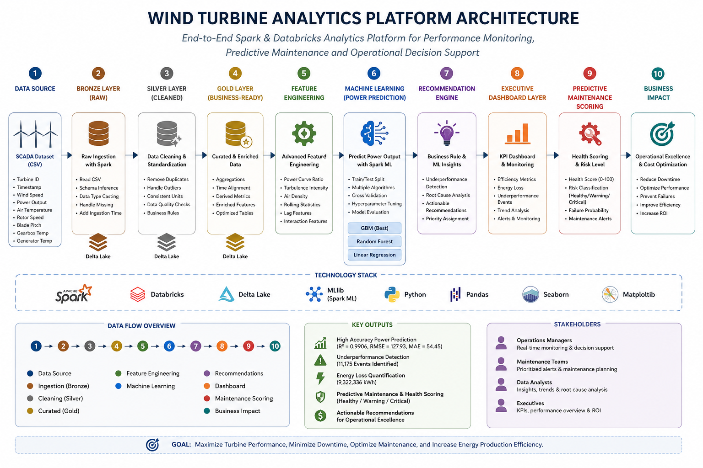

# Wind Turbine Analytics & Predictive Maintenance Platform



## Overview

This project presents an end-to-end industrial analytics solution for wind turbine performance monitoring using Apache Spark and Databricks.

The platform processes SCADA sensor data, detects operational inefficiencies, predicts power output, generates maintenance recommendations, and supports executive decision-making through dashboard-ready datasets.

The project follows modern Data Engineering, Analytics Engineering, and Machine Learning practices.

---

## Business Problem

Wind turbines operate continuously under changing environmental conditions.

Operational inefficiencies can lead to:

- Reduced energy production
- Increased maintenance costs
- Unexpected downtime
- Revenue losses
- Asset degradation

The goal of this project is to identify performance losses, predict turbine output, and provide actionable recommendations that support maintenance and operational teams.

---

## Solution Architecture

The platform follows a layered analytics architecture:

```text
SCADA Dataset
        ↓
Bronze Layer
        ↓
Silver Layer
        ↓
Gold Layer
        ↓
Advanced Feature Engineering
        ↓
Machine Learning
        ↓
Recommendation Engine
        ↓
Executive Dashboard Layer
        ↓
Predictive Maintenance Scoring
        ↓
Streamlit Analytics Application
```

---

## Technology Stack

### Data Engineering

- Apache Spark
- Databricks
- Spark SQL

### Data Processing

- PySpark DataFrames
- Window Functions
- Delta Tables

### Machine Learning

- Spark MLlib
- Linear Regression
- Random Forest Regressor
- Gradient Boosted Trees Regressor

### Analytics

- KPI Analysis
- Performance Monitoring
- Recommendation Engine
- Predictive Maintenance Scoring

### Application Layer

- Streamlit
- Plotly
- Databricks SQL Connector

---

## Dataset

Source:

Wind Turbine SCADA Dataset

Main variables:

- Timestamp
- Wind Speed
- Wind Direction
- Actual Power Output
- Theoretical Power Output

The dataset contains approximately 50,000 operational observations collected at 10-minute intervals.

---

## Data Pipeline

### Bronze Layer

Raw data ingestion and validation.

Activities:

- CSV ingestion
- Schema validation
- Data quality checks

Output:

```text
default.t_1
```

---

### Silver Layer

Data cleaning and standardization.

Activities:

- Column renaming
- Timestamp conversion
- Missing value handling
- Duplicate removal

Output:

```text
default.wind_turbine_silver
```

---

### Gold Layer

Business-ready analytical dataset.

Activities:

- Power Gap calculation
- Efficiency Ratio calculation
- Underperformance detection
- Time-based features

Output:

```text
default.wind_turbine_gold
```

---

## Advanced Feature Engineering

Additional predictive features were created using Spark Window Functions.

Features include:

- Previous Wind Speed
- Previous Power Output
- Rolling Average Wind Speed
- Rolling Average Power Output
- Wind Category
- Seasonal Indicators

These features significantly improved model performance.

---

## Machine Learning

### Objective

Predict turbine power output based on operational and environmental conditions.

### Models Evaluated

| Model | RMSE | MAE | R² |
|---------|---------:|---------:|---------:|
| Gradient Boosted Trees | 127.93 | 54.45 | 0.9906 |
| Random Forest | 135.13 | 66.00 | 0.9895 |
| Linear Regression | 159.01 | 97.00 | 0.9855 |

### Best Model

**Gradient Boosted Trees**

The model achieved:

- RMSE = 127.93
- MAE = 54.45
- R² = 0.9906

---

## Feature Engineering Impact

One of the key findings of the project was that feature engineering contributed more to predictive performance than algorithm selection.

The introduction of lag features, rolling statistics, seasonal indicators, and wind categories reduced prediction error substantially across all evaluated models.

---

## Recommendation Engine

A rule-based recommendation engine was developed to convert analytical outputs into operational actions.

### Risk Levels

- Low
- Medium
- High

### Recommended Actions

- Normal Operation
- Monitor Performance
- Immediate Inspection Required

Output:

```text
default.wind_turbine_recommendations
```

---

## Executive Dashboard Layer

Dashboard-ready datasets were created to support reporting and decision-making.

Generated Tables:

```text
default.dashboard_kpi_summary
default.dashboard_monthly_performance
default.dashboard_risk_distribution
default.dashboard_wind_analysis
default.dashboard_maintenance_priority
```

---

## Streamlit Application

A user-facing analytics application was developed using Streamlit.

The application connects directly to Databricks SQL Warehouse and provides an interactive interface for operational and maintenance teams.

### Key Features

- Executive KPI Dashboard
- Monthly Performance Monitoring
- Risk Analysis
- Maintenance Prioritization
- Health Monitoring
- CSV Report Export
- Databricks Live Connection

### Application Architecture

```text
Databricks SQL Warehouse
        ↓
Python SQL Connector
        ↓
Streamlit Application
        ↓
Business Users
```

### Dashboard Pages

- Executive Overview
- Performance Analysis
- Risk Analysis
- Maintenance Center
- Health Monitoring

The application transforms analytical outputs into a business-friendly interface that supports operational decision-making.

---

## Predictive Maintenance Scoring

A health scoring framework was developed to prioritize maintenance activities.

### Health Categories

- Healthy
- Warning
- Critical

### Distribution

| Status | Records |
|---------|---------:|
| Healthy | 16,442 |
| Warning | 14,921 |
| Critical | 19,167 |

Output:

```text
default.wind_turbine_health
```

---

## Business Results

### Executive KPIs

| KPI | Value |
|------|------:|
| Average Efficiency Ratio | 81.1% |
| Average Actual Power Output | 1307.68 kW |
| Average Theoretical Power Output | 1492.18 kW |
| Total Estimated Energy Loss | 9,322,337 kWh |
| Underperformance Events | 11,175 |

---

## Business Value

The solution enables:

- Energy loss quantification
- Underperformance detection
- Maintenance prioritization
- Operational monitoring
- Executive reporting
- Data-driven decision-making

---

## Repository Structure

```text
wind-turbine-analytics-platform/
│
├── notebooks/
├── app/
│   ├── app.py
│   └── databricks_connection.py
│
├── assets/
├── README.md
├── requirements.txt
└── wind_turbine_analytics_platform.dbc
```

---

## Future Improvements

Potential extensions:

- Multi-turbine analysis
- Real-time streaming with Spark Structured Streaming
- Azure Data Lake integration
- Databricks Workflows
- Automated retraining pipelines
- Predictive maintenance models based on sensor anomalies

---

## End-to-End Analytics Workflow

This project demonstrates a complete analytics lifecycle:

```text
Data Engineering
        ↓
Analytics Engineering
        ↓
Machine Learning
        ↓
Business Recommendations
        ↓
Dashboard Layer
        ↓
Application Layer
        ↓
Operational Decision Support
```

The solution simulates how industrial analytics platforms are developed and deployed in production environments.

---

## Author

Konstantinos Chasiotis

Apache Spark | Databricks | Machine Learning | Data Engineering | Industrial Analytics